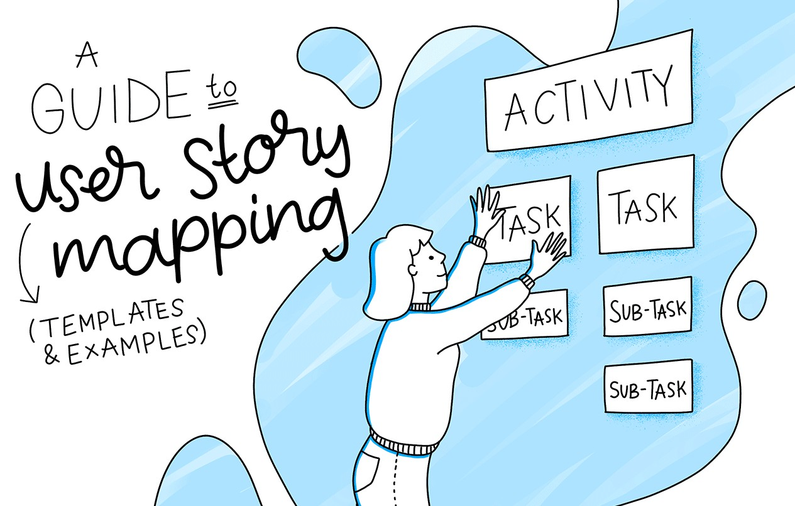

# Scrum med Jira 

## 1. Переводим эльфийского на человеческй

Начнём с самого неприятного. Вот основные термины из документа, но без академических объяснений.

### Scrum

Просто способ организовать работу над программой небольшими этапами. Вместо того чтобы пытаться сделать всё сразу, команда разбивает работу на короткие периоды, проверяет результат и продолжает.

### Jira

Обычная программа для учёта задач. Можно создать список дел, назначить исполнителей и перемещать карточки между колонками «Нужно сделать», «В работе» и «Готово».

### Backlog

Список всего, что когда-либо потребуется сделать в проекте. Например: создать страницу входа, сделать регистрацию, добавить меню, исправить ошибки.

     
### Sprint

Определённый промежуток времени, обычно одна или две недели, за который команда планирует выполнить часть задач. Это просто рабочий цикл с установленными началом и концом.

     
### User Story

Описание того, что пользователь хочет получить от программы. Например: «Как пользователь, я хочу создать аккаунт, чтобы просматривать свои предыдущие покупки».

### Daily Standup

Короткое ежедневное собрание, на котором каждый говорит, что сделал вчера, что собирается делать сегодня и что ему мешает.

     
### Sprint Review

Демонстрация того, что команда успела сделать за рабочий цикл. По сути, показать работающий результат и получить отзывы.

     
### Retrospective

Обсуждение после завершения цикла: что получилось, что не получилось и что можно изменить в следующий раз.

