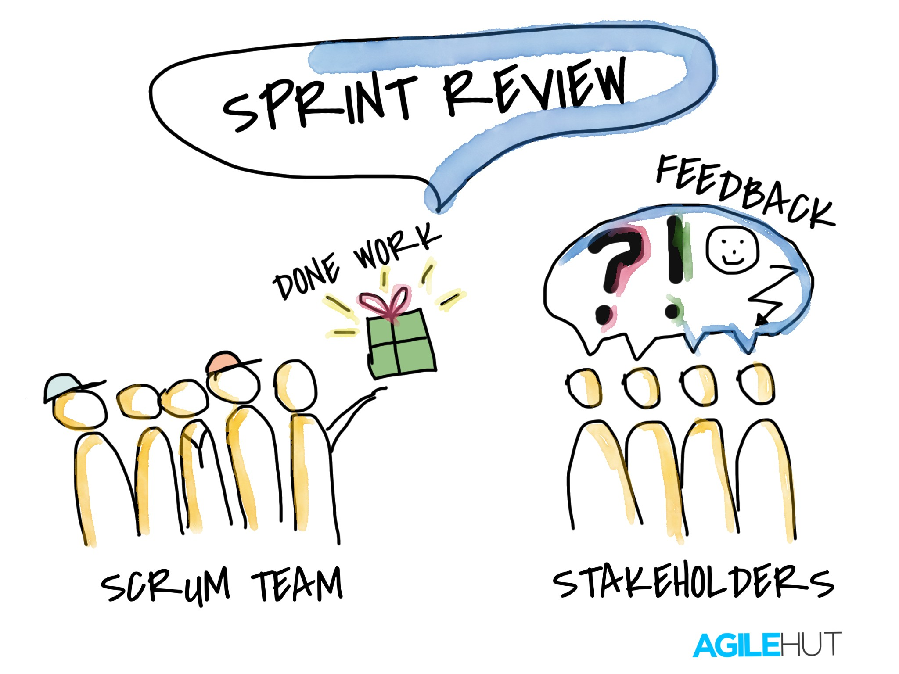
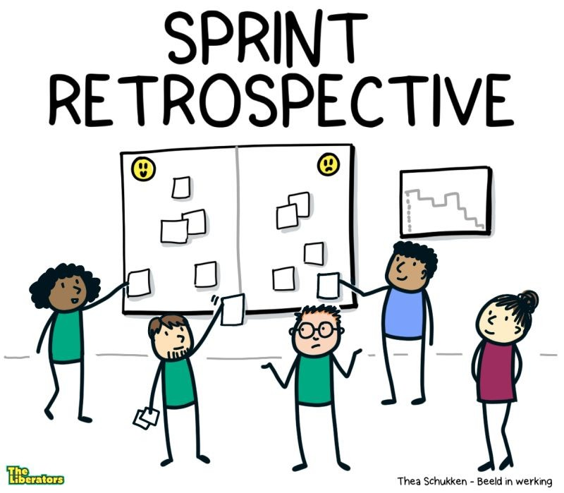
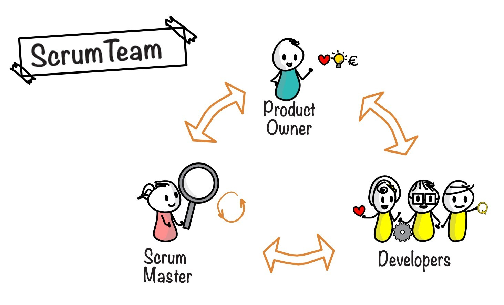
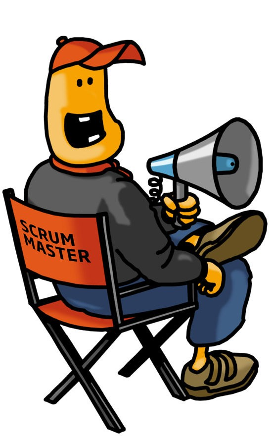

# Scrum med Jira 

[HABR](https://habr.com/en/articles/825354/)

## 1. Från alviska till begripligt språk

Vi börjar med det minst roliga. Här är de viktigaste begreppen från dokumentet, men utan akademiska förklaringar.

### Scrum

Ett enkelt sätt att organisera arbetet med ett program i mindre steg. I stället för att försöka göra allt på en gång delar teamet upp arbetet i korta perioder, kontrollerar resultatet och fortsätter sedan.

     
### Jira

Ett vanligt program för att hålla reda på uppgifter. Man kan skapa en att göra-lista, tilldela uppgifter till olika personer och flytta kort mellan kolumnerna ”Att göra”, ”Pågår” och ”Klart”.

### Backlog

En lista över allt som någon gång behöver göras i projektet.  
Till exempel: skapa en inloggningssida, lägga till registrering, skapa en meny och åtgärda fel.

     
### Sprint

En bestämd tidsperiod, vanligtvis en eller två veckor, då teamet planerar att slutföra en del av uppgifterna.  
Det är helt enkelt en arbetscykel med en tydlig start och ett tydligt slut.

     
### User Story

En beskrivning av vad användaren vill kunna göra i programmet.  
Till exempel: ”Som användare vill jag skapa ett konto så att jag kan se mina tidigare köp.”

### Daily Standup

Ett kort dagligt möte där alla berättar vad de gjorde i går, vad de planerar att göra i dag och om det finns något som hindrar dem från att arbeta.

     
### Sprint Review

En presentation av det som teamet har hunnit göra under arbetscykeln.  
I praktiken handlar det om att visa upp ett fungerande resultat och få återkoppling.

     
### Retrospective

En diskussion efter att arbetscykeln har avslutats: vad som gick bra, vad som inte fungerade och vad man kan förändra till nästa gång.

---

# Scrum-team

Ett Scrum-team är en liten, självorganiserande och tvärfunktionell grupp som vanligtvis består av högst 10 personer.  
De arbetar tillsammans för att leverera ett värdefullt produktinkrement under varje Sprint.

Hela **Scrum-teamet** har ett gemensamt **ansvar** för att skapa ett värdefullt och användbart **Increment** under varje Sprint.

> Det är viktigt att komma ihåg att ett Increment inte automatiskt innebär en release. Scrum kräver inte att en ny version av produkten släpps efter varje Sprint.

### Developers

**Developers** är de personer i Scrum-teamet som bidrar till att skapa alla delar av ett färdigt och användbart Increment under varje Sprint.

     
### Product Owner

**Product Owner** ansvarar för att **maximera värdet av produkten** som skapas genom Scrum-teamets arbete.

### Scrum Master

**Scrum Master** ansvarar för att **Scrum tillämpas** i enlighet med Scrumguiden.  
Detta gör de genom att hjälpa alla att förstå Scrums teori och arbetssätt, både inom Scrum-teamet och i organisationen.

> Det är viktigt att förstå att en Scrum Master inte bara är en chef som talar om för teamet hur arbetet ska utföras. Det är en person som **utbildar** teamet och **hjälper** det att arbeta enligt Scrum-metodiken genom att undanröja hinder.
>
> Scrum Master behöver inte själv delta aktivt i alla möten. Till exempel är det inte ett krav att Scrum Master deltar i Daily Scrum. Uppgiften är bland annat att lära teamet att hålla mötet inom 15 minuter, så att teamet sedan kan genomföra det självständigt.

