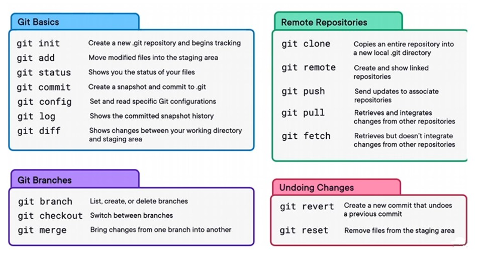

# Kort info om Git/Github



---

# Git & GitHub – snabbguide

## Grundmodell

```text
Working directory
      ↓
   Stage
      ↓
   Commit
      ↓
Local repository
      ↓
   Push
      ↓
Remote repository (GitHub)

Remote repository
      ↓
   Fetch
      ↓
origin/main
      ↓
   Pull
      ↓
Local repository
```

---

## Scenario 1 – Repository finns redan på GitHub

**Utgångsläge:**  
Repositoryt skapas först på GitHub. Du vill hämta det till din dator och börja arbeta lokalt.

```bash
git clone https://github.com/WEBD26JON/golfklubb-centar.git
cd golfklubb-centar
```

`clone` skapar både den lokala arbetsmappen och Git-kopplingen till `origin`.

### När andra har gjort ändringar

```bash
git pull
```

### När du har gjort egna ändringar

```bash
git add index.html       # en fil
git add css/             # en mapp
git add .                # alla ändringar

git commit -m "Beskriv ändringen"
git push
```

**VS Code:**

```text
Changes
   ↓
Stage Changes
   ↓
Message
   ↓
Commit
   ↓
Sync / Push
```

---

## Scenario 2 – Repository börjar lokalt

**Utgångsläge:**  
Projektet finns först bara på din dator.

```bash
mkdir golfklubb-centar
cd golfklubb-centar

git init
git add .
git commit -m "Initial commit"
```

Skapa sedan ett tomt repository på GitHub och koppla det till det lokala:

```bash
git remote add origin https://github.com/WEBD26JON/golfklubb-centar.git
```

Kontrollera:

```bash
git remote -v
```

Skicka sedan den lokala branchen till GitHub:

```bash
git branch -M main
git push -u origin main
```

Efter detta är det ett normalt Git/GitHub-arbetsflöde:

```text
ändra
  ↓
Stage
  ↓
Commit
  ↓
Push
```

---

## Scenario 3 – Hämta ändringar från GitHub

**Utgångsläge:**  
Någon annan har gjort `push` till GitHub.

### Bara kontrollera vad som finns på remote

```bash
git fetch
```

`fetch` hämtar information men ändrar inte dina arbetsfiler.

### Hämta och integrera ändringarna

```bash
git pull
```

`pull` = ungefär:

```bash
git fetch
git merge
```

---

## Scenario 4 – Skicka lokala ändringar till GitHub

**Utgångsläge:**  
Du har ändrat filer lokalt.

```bash
git status
git add .
git commit -m "Beskriv ändringen"
git push
```

Eller staga bara det du vill committa:

```bash
git add index.html
git add css/
```

I VS Code:

```text
Changes
 ├── index.html
 ├── css/
 └── images/

        ↓ Stage Changes

Staged Changes
 └── index.html
```

Endast staged ändringar kommer med i nästa commit.

---

## Scenario 5 – Push avvisas

**Utgångsläge:**  
Någon annan har hunnit göra `push` före dig.

```text
git push
   ↓
REJECTED
```

Hämta först ändringarna:

```bash
git pull
```

Lös eventuella konflikter → commit → push:

```bash
git push
```

**Använd inte `git push --force` som standardlösning.**

---

## Git och VS Code – terminologi

| Git CLI | VS Code / Source Control | Svenska |
|---|---|---|
| `git status` | Source Control → Changes | Ändringar |
| `git add fil.html` | Stage Changes | Staga filen |
| `git add css/` | Stage Changes | Staga mappen |
| `git add .` | Stage All Changes | Staga alla ändringar |
| `git restore fil.html` | Discard Changes | Kasta ändringar |
| `git commit` | Commit | Skapa commit |
| `git push` | Push / Sync | Skicka till remote |
| `git pull` | Pull / Sync | Hämta och integrera |

---

## Snabbval

| Situation | Kommando |
|---|---|
| Hämta ett nytt GitHub-repository | `git clone` |
| Skapa Git lokalt | `git init` |
| Koppla till GitHub | `git remote add origin ...` |
| Se ändringar | `git status` |
| Staga en fil | `git add fil` |
| Staga en mapp | `git add mapp/` |
| Staga allt | `git add .` |
| Skapa commit | `git commit -m "..."` |
| Hämta utan att integrera | `git fetch` |
| Hämta + integrera | `git pull` |
| Skicka commits till GitHub | `git push` |
| Visa remote | `git remote -v` |
