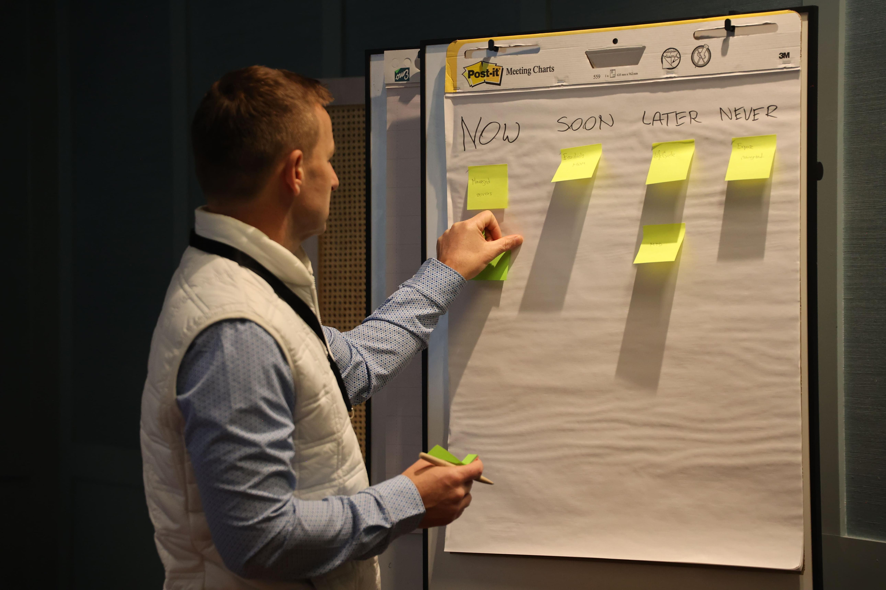
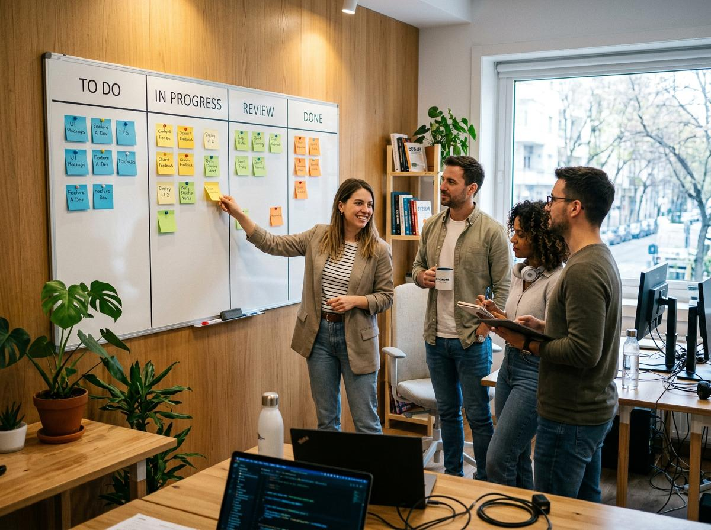

## Kursmoment 3 - "Agila arbetsmetoder" · Inlämningsuppgift

### Beskrivning:
I team om fyra eller fler måste deltagarna komma överens om en önskelista för vad de vill 
se i en broschyr/landningpage [(vad är det ladningspage?)](ladningssida.md) för sin ”ultimate resort”. Med hjälp av Jira måste teamen sedan 
skriva user stories för broschyren (t.ex. som förälder vill jag ha en barnvänlig atmosfär så att 
jag kan känna mig bekväm med att ta med barn; Som ägare vill jag annonsera ett specialerbjudande 
så att jag kan locka fler semesterfirare; osv.). 

Teamets valda **produktägare** (Jana) måste sedan prioritera varje berättelse genom att placera korten i 
prioritetsordning, bygga produktbacklogen. 

Teamen förbereder sig sedan för en 60 minuters iteration (tre 20-minutersdagar) genom att välja 
vilka berättelser de tror att de kan åstadkomma i den första iterationen. För varje utvald 
berättelse definierar teamet acceptanskriterier (definition av "gjort") för att klargöra krav och 
extrahera uppgifter (t.ex. hitta bild av stranden, skriva ortens namn på broschyren, skapa layout etc.). 

Varje dag i iterationen bör börja med ett snabbt Scrum-möte, där deltagarna flyttar uppgifter 
till kolumnen "Klart" och frivilligt för uppgifter genom att flytta dem till kolumnen "Pågående". 
Efter Scrum-mötet bör varje medlem börja producera i enlighet med acceptanskriterierna tills de tre 
dagarna och iterationen avslutas. 

En iteration bör avslutas med en demo av deras framsteg och en retrospektiv, där varje team listar 
vad de gjorde bra och vad de kan förbättra för nästa iteration. 

Upprepa iterationer efter behov. 

### Inlärningspunkter: 
Detta är en bra minisimulering av Scrum. Det ger varje deltagare en känsla av kontroll och 
synlighet i allt arbete som pågår. 

**Inlämning:** Lämna in en textuell dokument med demo ni hade efter varje iteration 
(skärmdump eller liknande) och eventuella frågor ni hade under utförande.

**OBS!** ni behöver ej bygga någon färdigt lösning för att slutföra denna uppgift.

---

## Grupp 1 – Tillgänglighet för möten

| Dag       | Alexander | Fredrik          |    Jana   |  Husein  |
|-----------|-----------|------------------|-----------|----------|
| Måndag    |    NA     | Valfri tid       |Valfri tid |Valfri tid|       |
| Tisdag    |   13-15   | 13:00–17:00      |     NA    | ? |
| Onsdag    |   13-15   | 13:00–17:00      |     NA    | ? |
| Torsdag   |   13-15   | 13:00–17:00      |     NA    | ? |
| Fredag    |    NA     | Valfri tid       |     NA    | ? |
| Lördag    |    NA     | Helst undviks    |Helst undviks| ? |
| Söndag    |    NA     | Helst undviks    |Helst undviks| ? |

# TFM

Läs mer om [Scrum och Jira](../Scrum-Jira.md)

### 🤖 #1A gemma4:31b-cloud

Detta är en praktisk övning i Agila arbetsmetoder, där din grupp ska simulera arbetet av ett riktigt Scrum-team kring ett litet projekt.

Det viktigaste: ni behöver inte skapa en riktig webbplats eller en färdig broschyr. Ni ska lära er att planera arbetet, fördela uppgifter, prioritera och genomföra korta Scrum-iterationer med hjälp av Jira.
Hela arbetet är beräknat till 60–90 minuter och bedöms inte med betyg.

**1. Vad ni ska skapa**
Er grupp ska komma på ett koncept för sin ideala resort (The ultimate resort).

Till exempel kan det vara en familjeresort vid havet som har:
- Hotell med havsutsikt.
- Barnpool och lekplats.
- Restaurang med lokal mat.
- Spa och relaxavdelning.
- Specialerbjudanden för turister.
Er uppgift är att komma överens om vad ni skulle vilja se i en reklambroschyr eller på en landningssida för denna resort.

## 2. Steg-för-steg-instruktioner
Antag att det är fyra personer i er grupp. 

### Steg 1. Skapa projekt i Jira
Varje deltagare skapar ett konto i Jira.  
 
En av deltagarna **(Husein)** skapar ett gemensamt projekt och bjuder in de övriga. - **KLART**
I Jira kommer ni att hantera alla uppgifter, följa upp genomförandet och se det gemensamma framsteget.

### Steg 2. Skapa en önskelista (Product Backlog)
Diskutera tillsammans vad som ska finnas i er broschyr eller på landningssidan. Skriv sedan ner varje önskemål i form av en User Story (användarberättelse). 
 
Exempel:
- Som förälder vill jag se information om barnaktiviteter, för att förstå om resorten passar min familj.
- Som turist vill jag se bilder på stranden, för att kunna bedöma semesterstället.
- Som ägare av resorten vill jag marknadsföra specialerbjudanden, för att locka fler turister.
Varje story skapas i Jira som ett separat kort.

### Steg 3. Välj Product Owner och prioritera
En av deltagarna blir **Product Owner (produktägare)** - Jana.  
 
Dennes uppgift är att organisera prioriteringen av alla User Stories och ordna dem efter viktighet för att forma Product Backlog. 
Exempelvis: först bilder på resorten och grundläggande information, sedan aktiviteter och specialerbjudanden.

### Steg 4. Planera första iterationen (Sprint Planning)
I denna övning varar en iteration (Sprint) i 60 minuter och delas upp i tre fiktiva arbetsdagar på 20 minuter vardera.
Teamet väljer ut några User Stories från Product Backlog som de realistiskt kan genomföra under denna iteration. 
 
För varje vald story ska ni:
- Definiera acceptanskriterier (Acceptance Criteria) – vad som måste vara gjort för att storyn ska räknas som klar.
- Dela upp storyn i konkreta uppgifter (Tasks).
Exempel för storyn om bilder:
- Hitta bild på stranden.
- Hitta bild på hotellet.
- Förbereda bildtexter.
- Placera materialet i broschyrutkastet.

### Steg 5. Genomför Sprinten (tre fiktiva arbetsdagar)
I början av varje 20-minutersetapp hålls en kort Daily Scrum (dagligt möte).  
 
Varje deltagare berättar:
- Vad jag har gjort.
- Vad jag planerar att göra härnäst.
- Om det finns några hinder.
Därefter flyttar deltagarna korten i Jira mellan kolumnerna:
- To Do – ej påbörjat.
- Pågående – utförs.
- Klart – slutfört.
Efter mötet arbetar var och en med sina valda uppgifter. Det är inte nödvändigt att skriva kod; ni kan förbereda text, leta bilder eller göra ett enkelt utkast.

### Steg 6. Demo och Retrospective
Efter att den 60 minuter långa iterationen är slut demonstrerar teamet resultatet (Demo). Detta kan vara ett ofärdigt utkast eller en samling förberedda material.
Därefter hålls en Retrospective (utvärdering) där ni diskuterar:
- Vad gick bra?
- Vad gick inte bra?
- Vad kan förbättras i nästa iteration?
Om tiden tillåter kan ni upprepa iterationen.

## 3. Hur det kan se ut i Jira
Exempelvis kan er Product Backlog innehålla följande kort:

| User Story | Prioritet | Status |
| :--- | :--- | :--- |
| Bilder på strand och hotell | 1 | Klart |
| Information om läge | 2 | Pågående |
| Barnaktiviteter | 3 | To Do |
| Specialerbjudanden | 4 | To Do |
| Kontaktinformation | 5 | To Do |

Detta är bara ett exempel. Prioriteringarna bestäms av ert team. För en vald User Story kan ni skapa underuppgifter (Subtasks), tilldela dem till gruppmedlemmar och följa upp genomförandet i Jira.

## 4. Vad som ska lämnas in till läraren
**Inlämning — textdokument**
Enligt uppgiften ska ni förbereda ett dokument som innehåller:
- Skärmdumpar eller liknande material från demonstrationen (Demo) efter varje iteration.
- Frågor som uppstod under övningen.
Om ni har genomfört flera iterationer, visa resultaten från var och en av dem. En färdig webbplats, fullständig broschyr eller fungerande prototyp krävs inte.

## 5. Roller och ansvarsområden
I Scrum finns olika roller, men i denna övning kan de fördelas enligt följande:

| Roll | Uppgift | Ansvarig person |
| :--- | :--- | :--- |
| Product Owner | Prioriterar User Stories och formar Product Backlog | **- Jana** |
| Scrum Master | Hjälper till att organisera Scrum-processen och tar bort hinder | **- Husein**  |
| Development Team | Genomför uppgifterna gemensamt och förbereder resultatet | **- Alexander och Fredrik**  |

I en liten studiegrupp kan rollerna kombineras, och alla deltagare ska delta i planering och diskussioner.

## 6. Vad som faktiskt förväntas av er
Huvudmålet är inte att skapa en produkt, utan att prova Scrum i praktiken.
1. Lära sig formulera krav som User Stories.
2. Förstå hur Product Backlog fungerar och hur prioritering går till.
3. Lära sig bryta ner stora uppgifter till små, konkreta handlingar.
4. Prova korta Daily Scrums och följa arbetet i Jira.
5. Visa resultatet och diskutera förbättringar till nästa iteration.

Praktiskt sett: det räcker med att ni hittar på en resort, skapar några User Stories i Jira, väljer stories för första sprinten, definierar acceptanskriterier och uppgifter, genomför tre fiktiva 20-minutersarbetssteg, och därefter visar resultatet och håller en retrospektiv.

Eftersom övningen inte betygssätts och ingen färdig lösning krävs, är det viktigt att ni demonstrerar förståelse för processen snarare än att lägga all tid på att designa en webbplats.

*(⏱ 9.83s)*

